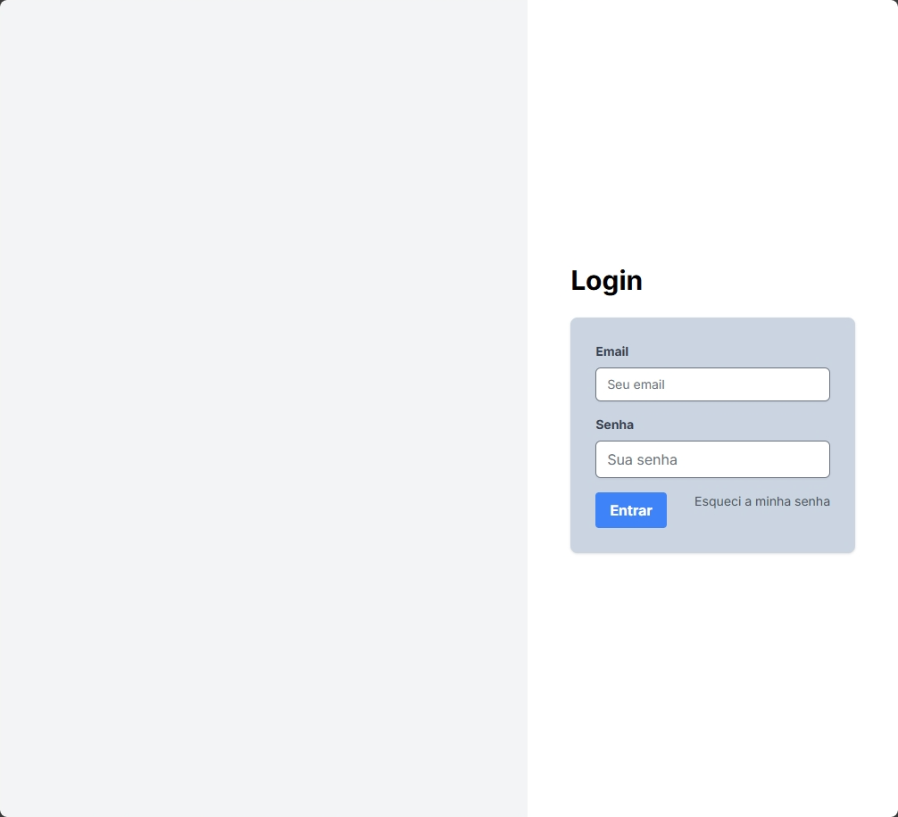
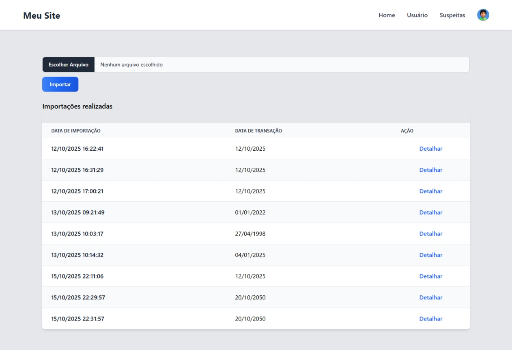
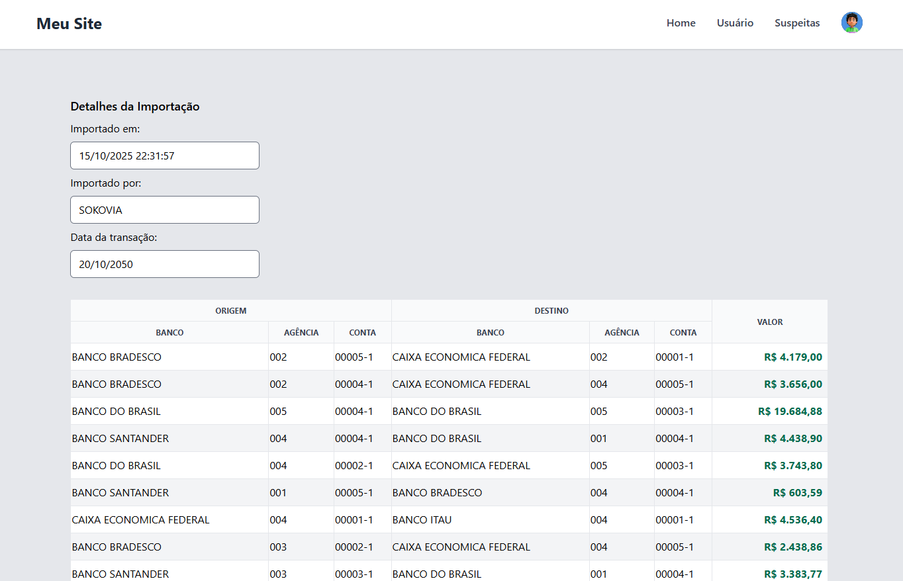
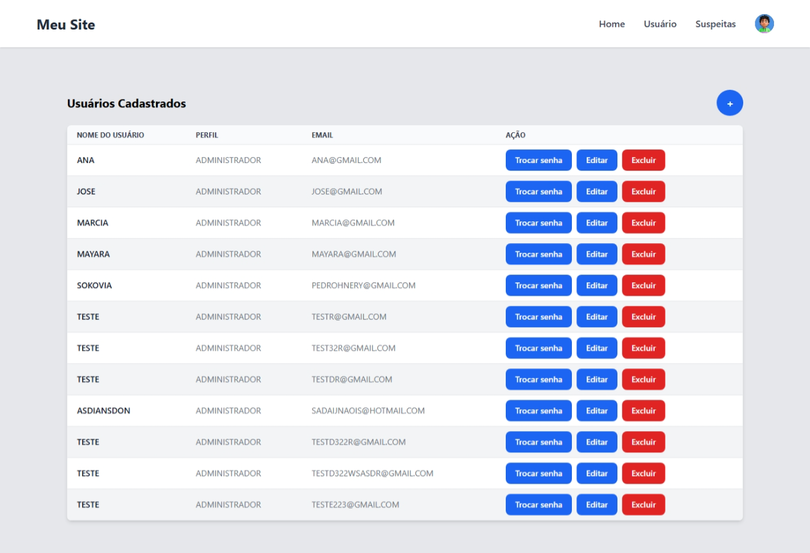
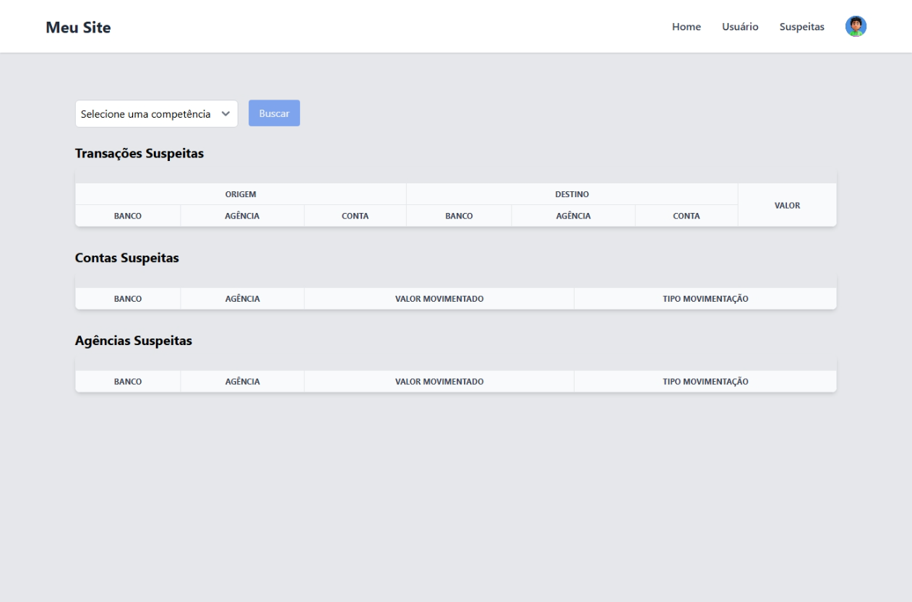
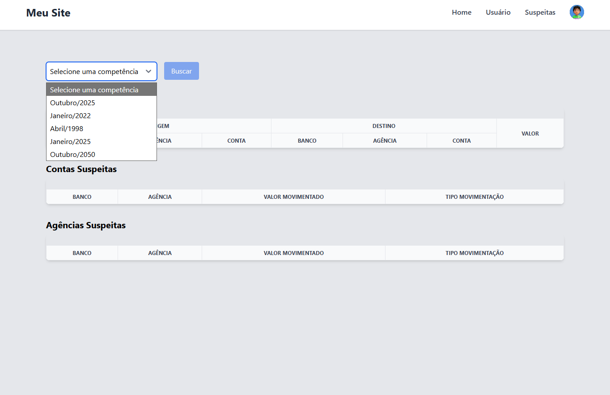
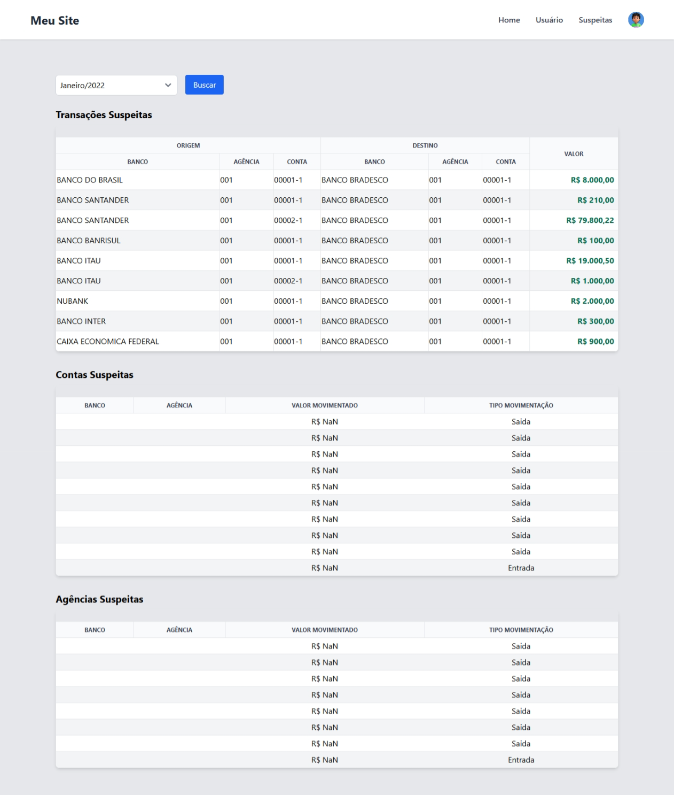
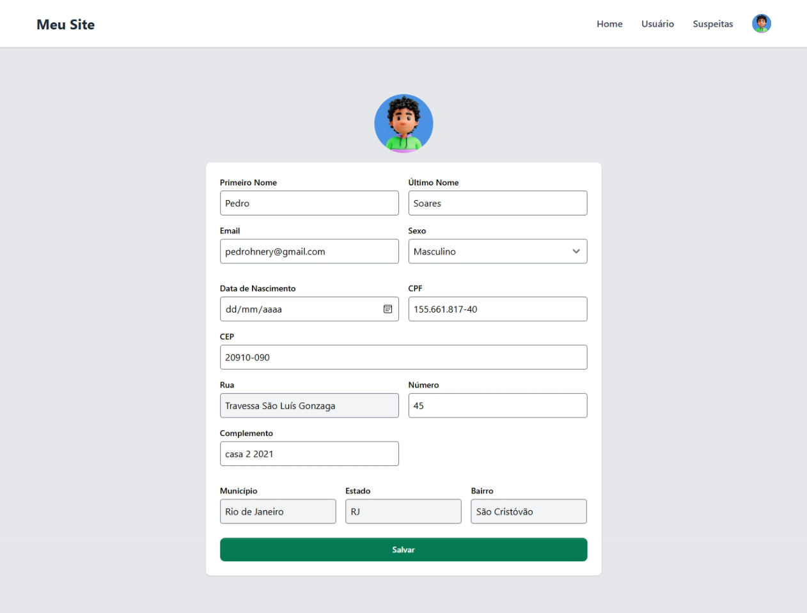

# 💳 Controle de Transações

### 📘 Sobre o Projeto
Desafio proposto pela **Alura**, o **Controle de Transações** é uma aplicação completa que permite **importar, analisar e visualizar transações bancárias** de forma simples e segura.  
O objetivo é auxiliar empresas e instituições no **monitoramento de movimentações financeiras**, com foco na **identificação de operações suspeitas**.

> ⚠️ **Status do Projeto:** Em Desenvolvimento 🚧  
> Algumas funcionalidades podem estar em fase de ajustes e aprimoramentos.
---

## 🚀 Principais Funcionalidades

✅ **Gestão de Usuários** — Cadastro, edição e controle de acesso.  
✅ **Envio Automático de E-mail** — O sistema envia a senha inicial ao novo usuário.  
✅ **Importação de Arquivos CSV e XML** — Suporte a formatos amplamente utilizados no setor bancário.  
✅ **Visualização de Transações** — Consulta rápida, com filtros por data e tipo.  
✅ **Identificação de Transações Suspeitas** — Detecção automática de movimentações fora do padrão.  

---
## Snapshots
## 📸 Snapshots

<div style="display: flex; flex-wrap: wrap; gap: 10px; justify-content: center;">
  
  
  
  
  
  
  
  
</div>

 

---
## 🛠️ Tecnologias Utilizadas

### ⚙️ Back-end


### 💻 Front-end

 


### 💻 Automações


---

## 🛠️ Utilitários
Com o objetivo de otimizar o processo de testes e validação da importação de arquivos, foi desenvolvido um gerador de arquivos em Python capaz de criar dados aleatórios no formato CSV e XML.


---
## 📂 Estrutura do Projeto

```
controle-transacao/
 ├── backend/          # API em Spring Boot (Java)
 │   ├── src/
 │   ├── pom.xml
 │   └── application.yml
 ├── frontend/         # Interface em Next.js + TypeScript
 │   ├── src/
 │   ├── package.json
 │   └── next.config.js
 ├── database/         # Scripts e configurações do MySQL
 └── README.md
```

---

## ⚙️ Como Executar o Projeto Localmente

### 🔧 Pré-requisitos
Antes de iniciar, verifique se você possui instalado:
- **Java 17+**
- **Node.js 18+**
- **MySQL 8+**
- **Maven**
- **NPM ou Yarn**

---

### ▶️ Executando o Back-end (Spring Boot)

```bash
# Acesse a pasta do backend
cd backend

# Configure o arquivo application.yml com suas credenciais do banco

# Execute o projeto
mvn spring-boot:run
```

O servidor será iniciado em:  
👉 **http://localhost:8080**

---
## 📦 Migrações de Banco de Dados (Flyway)

O projeto utiliza o **Flyway** para **controle e versionamento do banco de dados**, garantindo que todas as alterações no schema sejam aplicadas de forma **automática, reproduzível e segura** em diferentes ambientes.

### 🧩 Estrutura de Versionamento

As migrações ficam localizadas na pasta: challenger\src\main\resources\db\migration

---
### 💻 Executando o Front-end (Next.js)

```bash
# Acesse a pasta do frontend
cd frontend

# Instale as dependências
npm install
# ou
yarn install

# Execute o projeto
npm run dev
# ou
yarn dev
```

A aplicação estará disponível em:  
👉 **http://localhost:3000**

--- 

## 👨‍💻 Desenvolvido por

Projeto desenvolvido como parte do **Desafio Alura**, com foco em boas práticas, integração entre sistemas e monitoramento inteligente de dados financeiros.  

📧 **Autor:** Pedro Nery  
🔗 **LinkedIn:** [[Pedro Nery](https://www.linkedin.com/in/pedro-nery-8831901b1/)]   
 
